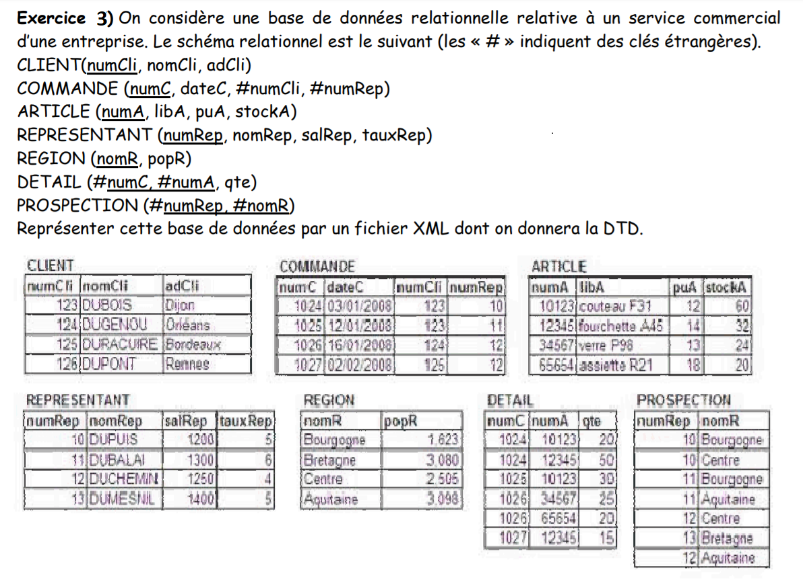

# Exercise 3 ✅
---

### We consider a relational database relating to a commercial service of a company. The relational diagram is as follows (the “#” indicate foreign keys).

```
CLIENT(numCli, nomCli, adCli)
COMMANDE (numC, dateC, #numCli, #numRep)
ARTICLE (numA, libA, puA, stockA)
REPRESENTANT (numRep, nomRep, salRep, tauxRep)
REGION (nomR, popR)
DETAIL (#numC, #numA, qte)
PROSPECTION (#numRep, #nomR)
```

### Represent this database by an XML file which will be given the DTD.

> look to the arrays structures ..

